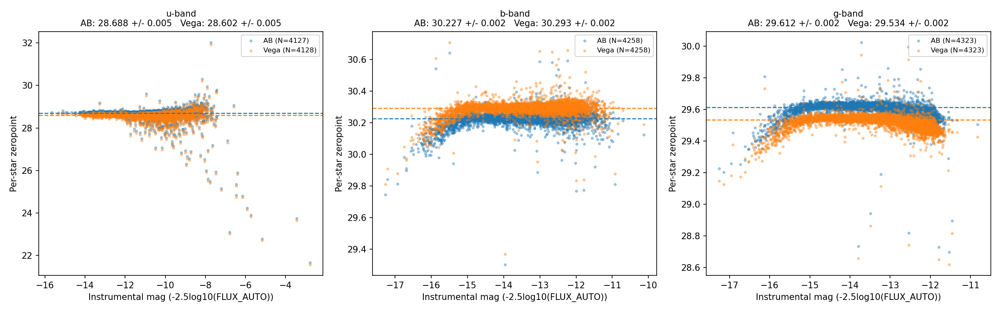

# SuperBIT zeropoints

Computes SuperBIT's u, b, g magnitude zeropoints from Gaia DR3 XP spectra.
**Read `theory.md` first** for how and why this works, in plain language.

## Setup

```bash
git clone <this-repo> && cd <this-repo>
pip install -r requirements.txt
bash scripts/download_ck04models.sh   # ~41MB stellar atmosphere grid
```

Then get the large data this repo doesn't ship in git (SuperBIT star
catalogs + Gaia XP spectra, ~200MB) into `external_data/`. This isn't
reachable from every filesystem, so grab it from either:

- hen: `/data/analysis/superbit_2023/sayan/zp_data/external_data`
- [Google Drive](https://drive.google.com/drive/folders/1t-GOyoJ9phlzvC2cKMEfg3B_TpKp-xte)

## Running it

```bash
python scripts/validate_against_gaia.py   # sanity check (optional but recommended)
python src/compute_sb_zeropoints.py       # main pipeline, ~25 min first run
```

Writes per-star tables and diagnostic plots to `outputs/`. Edit
`config.yaml` to change the flux column, aggregation method, or paths.

## Result

| Band | ZP (AB) | ZP (Vega) |
|------|---------|-----------|
| u | 28.689 ± 0.005 | 28.602 ± 0.005 |
| b | 30.227 ± 0.002 | 30.293 ± 0.002 |
| g | 29.612 ± 0.002 | 29.534 ± 0.002 |

(jackknifed across 30 target fields; see `theory.md` for why that error
bar, not a flat per-star one, is the one to trust)


