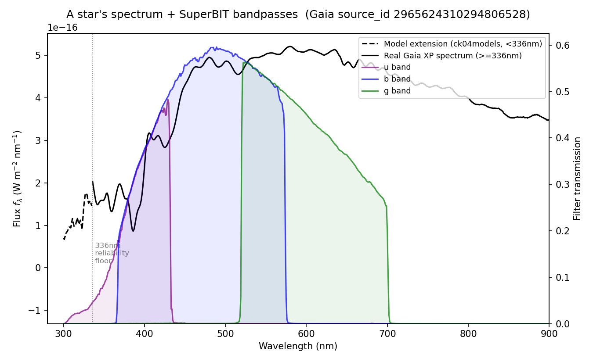
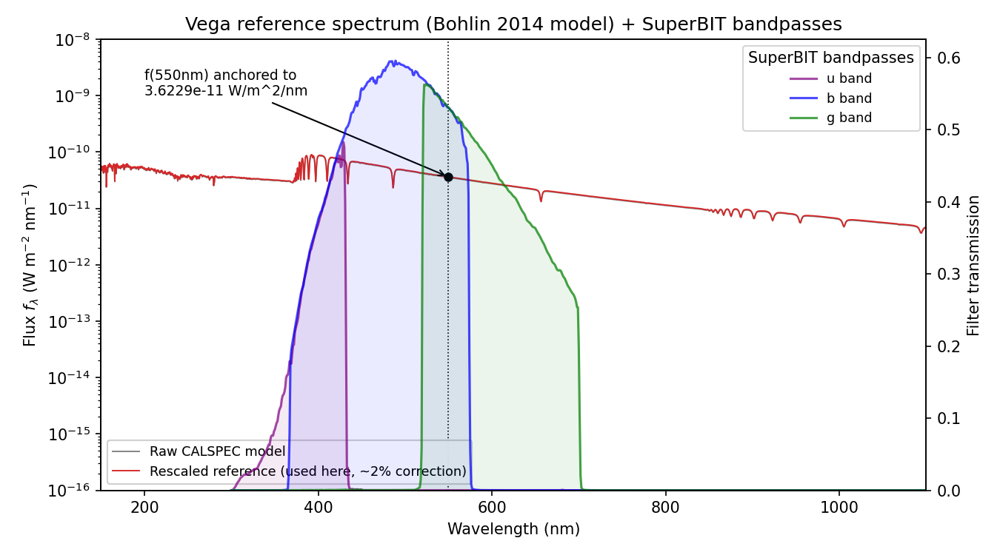
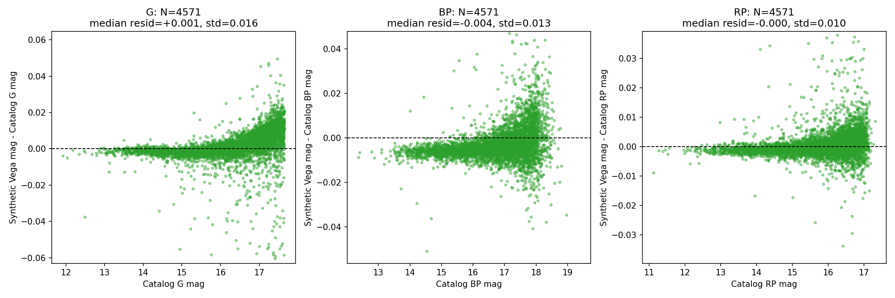

This document explains *why* the code in this repo works, without assuming
you already know synthetic photometry. See `README.md` for how to run it.

## The goal

SuperBIT measures a star's brightness as a raw "instrumental flux",
`FLUX_AUTO` (call it $F$), with no absolute physical meaning by itself. A
**magnitude zeropoint** converts that number into a real, calibrated
magnitude:

$$m_{\rm true} = -2.5\log_{10}(F) + \text{ZP}$$

To find ZP we need stars whose true magnitude we already know
independently. Gaia gives us that: for ~4500 stars, Gaia has published an
actual observed spectrum. If we know a star's real spectrum and exactly
what wavelengths SuperBIT's u/b/g filters transmit, we can calculate what
magnitude that star *should* have through those filters — no telescope
observation needed, just an integral. That's **synthetic photometry**.

## A spectrum + a filter = a magnitude

Every star has a spectrum `f_λ(λ)`: flux density vs. wavelength. Every
filter has a transmission curve `S(λ)`: 0 = blocked, 1 = fully transmitted.

"The brightness through the b-band filter" is a **transmission-weighted
average of the spectrum** over the filter's wavelength range
(`synthetic_photometry.py`'s `mean_fnu()` / `mean_flambda()`):

$$\langle f_\lambda \rangle = \frac{\int f_\lambda(\lambda)\ S(\lambda)\ \lambda\ d\lambda}{\int S(\lambda)\ \lambda\ d\lambda}
\qquad
\langle f_\nu \rangle = \frac{\int f_\lambda(\lambda)\ S(\lambda)\ \lambda\ d\lambda}{\int S(\lambda)\ (c/\lambda)\ d\lambda}$$

(The extra `λ` weights by photon count, not energy — real detectors count
photons.)

## Filling in the UV (`xp_uv_extrapolation.py`)

Gaia's spectra are only reliable down to ~336 nm, but SuperBIT's u-band
transmits starting around 300 nm (purple curve above, already nonzero
before the gray "336 nm" line). For stars with a known temperature,
surface gravity, and metallicity, we grab a matching theoretical
(Castelli-Kurucz `ck04models`, [Castelli & Kurucz
2004](https://arxiv.org/abs/astro-ph/0405087)) atmosphere model via
[`stsynphot.catalog.grid_to_spec`](https://stsynphot.readthedocs.io/en/latest/api/stsynphot.catalog.grid_to_spec.html),
rescale it to match the *real* Gaia data in a 336-360 nm overlap window,
and splice it onto the blue end — the dashed line above.

## AB and Vega magnitudes

Two conventions for "what does magnitude 0 mean":

$$m_{AB} = -2.5\log_{10}\left(\frac{\langle f_\nu \rangle}{3631\ \text{Jy}}\right)
\qquad\qquad
m_{\rm Vega} = -2.5\log_{10}\left(\frac{\langle f_\lambda \rangle_{\rm star}}{\langle f_\lambda \rangle_{\rm Vega}}\right)$$

AB fixes magnitude 0 to a flat reference spectrum with flux density 3631 Jy
at every frequency, where:

$$1{\rm Jy} = 10^{-26}{\rm W m^{-2} Hz^{-1}}\ ({\rm SI}) = 10^{-23} {\rm erg s^{-1} cm^{-2} Hz^{-1}}\ ({\rm CGS})$$

**Why a flat spectrum:** it makes AB magnitude a property of the *filter*, not of some
specific star's spectral quirks — a source with constant $f_\nu$ gets the
same AB magnitude in every band, by construction. Vega magnitudes don't
have that property, since Vega's real spectrum has absorption features
(seen as the dips in the figure below) that shift the Vega-AB offset
differently in every band, and can even flip sign (we saw exactly this
happen between u/g vs. b for SuperBIT). 3631 Jy specifically was chosen so
AB roughly matches the old Vega-based V-band magnitude scale, for
backward compatibility. All spectra and flux quantities in this pipeline
are kept in SI units (W, m, nm) throughout, consistently.

The Vega reference spectrum used for $m_{\rm Vega}$ above (a CALSPEC model,
Bohlin 2014) is shown below, with SuperBIT's bandpasses overlaid — note the
absorption features referred to above, which are exactly what make the
Vega-AB offset band-dependent:

## Sanity check: does this reproduce Gaia's own magnitudes?

Before trusting a SuperBIT zeropoint, the same machinery should reproduce
something already known: real Gaia G/BP/RP magnitudes, computed from
first principles (spectrum + Gaia's own passband + our Vega spectrum,
*not* Gaia's zeropoint file) via `scripts/validate_against_gaia.py`.
Residuals (synthetic − catalog) for ~4500 stars, per Gaia band:

Median residuals ≈ 0 mag with ~0.01-0.02 mag scatter — the pipeline
recovers Gaia's own calibration, so the identical code path with
SuperBIT's bandpasses swapped in should be trustworthy too.

## One zeropoint per band (`compute_sb_zeropoints.py`)

Every star gives one estimate ($F_i$ is that star's `FLUX_AUTO`, $m_i$ its
synthetic magnitude):

$$\text{ZP}_i = m_i + 2.5\log_{10}(F_i)$$

Very bright stars (instrumental magnitude below `bright_mag_cut`, shaded gray
below) are dropped first -- they visibly pull away from the flat trend,
consistent with detector saturation. The remaining ~4000-4500 per-star
estimates are combined with error-weighting and a leave-one-target-out
jackknife into one zeropoint per band, with an error bar:

## References

- [`stsynphot.catalog.grid_to_spec`](https://stsynphot.readthedocs.io/en/latest/api/stsynphot.catalog.grid_to_spec.html) — pulls the ck04models spectrum for a given Teff/logg/[Fe/H]
- [Castelli & Kurucz (2004)](https://arxiv.org/abs/astro-ph/0405087) — the ck04models atmosphere grid
- [Gaia DR3 photometric calibration documentation](https://gea.esac.esa.int/archive/documentation/GDR3/Data_processing/chap_cu5pho/cu5pho_sec_photProc/cu5pho_ssec_photCal.html)
- [AB magnitude — Wikipedia](https://en.wikipedia.org/wiki/AB_magnitude)
- [THE Pan-STARRS1 PHOTOMETRIC SYSTEM](https://iopscience.iop.org/article/10.1088/0004-637X/750/2/99)
- [Jansky/AB magnitude conventions explained](https://pdn4kd.github.io/2020/10/28/janskyabmag.html)
- [Ajay's thesis](https://utoronto.scholaris.ca/items/9b6ae5fe-04cd-44bf-be63-67e6ea6dd68f)
